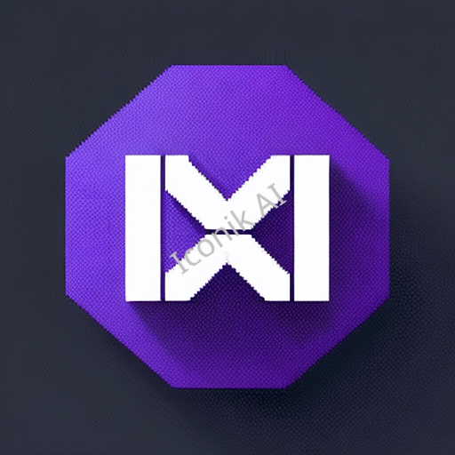

# Pro Start Extension Bundle

**Version:** 1.0.8  
**Publisher:** shekhardtu  
**Visual Studio Code Version:** ^1.21.0  

## Description

The Pro Start Extension Bundle is a collection of some of the most popular and essential Visual Studio Code extensions. Whether you're working on a ReactJS project or a NodeJS project, this extension pack will help you set up your development environment quickly and efficiently. It includes extensions for linting, formatting, theming, debugging, Git integration, and more.

## Features

- Simplify your development workflow with a curated set of extensions.
- Ideal for both ReactJS and NodeJS projects.
- Enhance code quality with linting and formatting tools.
- Customize your coding experience with themes and icons.
- Streamline Git-related tasks and collaborate seamlessly.
- Improve productivity with helpful snippets and code runners.

## Included Extensions

- [npm Intellisense](https://marketplace.visualstudio.com/items?itemName=christian-kohler.npm-intellisense)
- [npm Script Runner](https://marketplace.visualstudio.com/items?itemName=eg2.vscode-npm-script)
- [Code Spell Checker](https://marketplace.visualstudio.com/items?itemName=streetsidesoftware.code-spell-checker)
- [Path Intellisense](https://marketplace.visualstudio.com/items?itemName=christian-kohler.path-intellisense)
- [Markdownlint](https://marketplace.visualstudio.com/items?itemName=DavidAnson.vscode-markdownlint)
- [Better Comments](https://marketplace.visualstudio.com/items?itemName=aaron-bond.better-comments)
- [Auto Rename Tag](https://marketplace.visualstudio.com/items?itemName=formulahendry.auto-rename-tag)
- [Import Cost](https://marketplace.visualstudio.com/items?itemName=wix.vscode-import-cost)
- [GitLens](https://marketplace.visualstudio.com/items?itemName=eamodio.gitlens)
- [VSCode Icons](https://marketplace.visualstudio.com/items?itemName=robertohuertasm.vscode-icons)
- [Material Palenight Theme](https://marketplace.visualstudio.com/items?itemName=whizkydee.material-palenight-theme)
- [GitHub Copilot](https://marketplace.visualstudio.com/items?itemName=GitHub.copilot)
- [GitHub Copilot Chat](https://marketplace.visualstudio.com/items?itemName=GitHub.copilot-chat)
- [Code Runner](https://marketplace.visualstudio.com/items?itemName=formulahendry.code-runner)
- [YAML](https://marketplace.visualstudio.com/items?itemName=redhat.vscode-yaml)

## Installation

1. Install [Visual Studio Code](https://code.visualstudio.com/) if you haven't already.
2. Launch Visual Studio Code.
3. Go to the Extensions view by clicking on the Extensions icon in the Activity Bar on the side of the window.
4. Search for "Pro Start Extension Bundle."
5. Click the Install button.

## Usage

Once installed, the Pro Start Extension Bundle will provide you with a set of essential tools and extensions to kickstart your projects. Enjoy a smoother development experience!

## License

This project is licensed under the [MIT License](https://github.com/shekhardtu/pro-start/blob/master/LICENSE).

## Bugs and Contributions

If you encounter any issues or have suggestions for improvements, please submit them through [GitHub Pull Requests](https://github.com/shekhardtu/pro-start/pulls) or contact the developer at <shekhardtu@gmail.com>.

## Repository

- **GitHub Repository:** [https://github.com/shekhardtu/pro-start](https://github.com/shekhardtu/pro-start)

---

**Note:** This README.md file is autogenerated. For the most up-to-date information, please visit the [GitHub repository](https://github.com/shekhardtu/pro-start).
